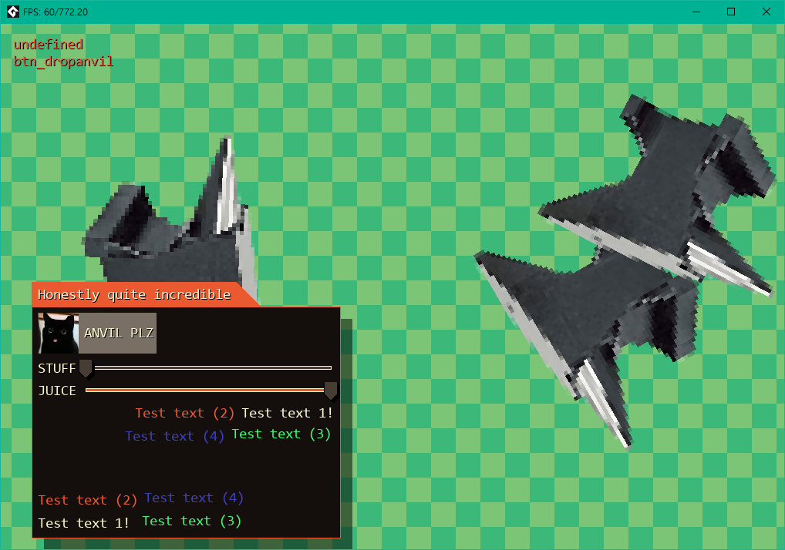
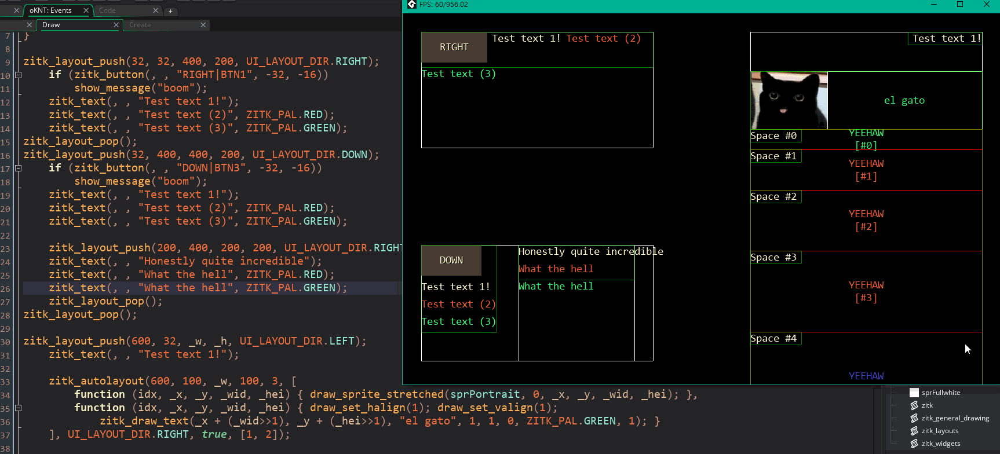
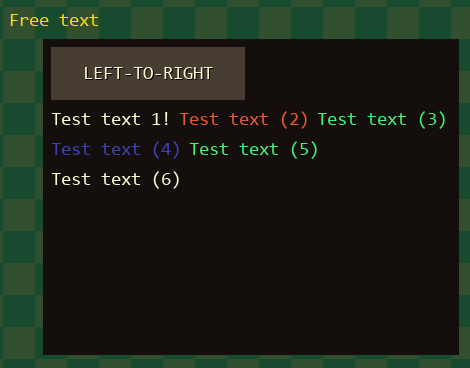
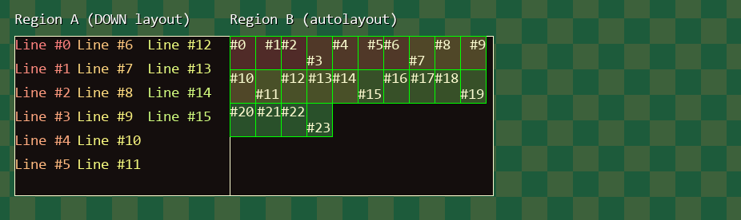

# ZITK: Experimental immediate mode GUI toolkit for Gamemaker (early test version!)
...And also an [IMNOTGUI](https://github.com/TandyRum1024/sincerly-imnotgui-gml) rewrite/successor from Gamemaker Studio 1




# Overview of implemented functions & widgets

### Basic functions
- [x] General purpose hash memory: literally a struct that holds temporary values for UI
- [x] Input wrapping system
- [x] Tag system: ID and displayed string wrangling
- [x] ID stack / prefix
- [x] Auto/Meta-layout: automatically divide given region and callback function passing region as parameter for easier layout design
- [x] 'Imperative' layout: each consecutive item draws will be automatically arranged according to current layout, unlike traditional drawing method unless specified
- [x] Layout push / pop
- [x] Nest-able layouts using stacks
- [x] Manual layout: enables users to manually set the position of UI elements like traditional drawing
- [ ] Clipping regions: for scrollable & overflow clip-obeying UI elements
- [ ] Scrolling regions with scrollbar support
### Generic drawing helpers
- [x] Text and textboxes, including shadowed ones
- [ ] String trimmer, for text overflow handling
- [x] Batch-friendly, sprite based (wire) rectangles
- [x] Colour manipulation: addition for each RGB channels
- [ ] Batched 2D polygon renderer for complex shapes
- [ ] (Bézier) curves
### Widgets
- [x] Label / text
- [x] Generic button behaviour for button-like subwidgets (ex: slider knob)
- [x] Button
- [x] Sprite button with separate text & sprite aligns
- [ ] Button: callback based, customizable drawing & input events
- [ ] Text boxes & Number boxes (for both integer & float values)
- [x] Horizontal slider
- [ ] Vertical slider
- [ ] Simple separator graphics
- [ ] Sliders: support both float and integer values
- [ ] Foldable region
- [ ] Tabs

# Sample usage
```gml
// Sets up the new layout, and pushes the previous layout onto stack
// It's dimensions are [400, 300]px, and its positions at [600, 80]px
zitk_layout_push(600, 80, 400, 300, UI_LAYOUT_DIR.RIGHT);
	// (simple draw_rectangle() wrapper)
	zitk_draw_rect(UI_LAYOUT_X1-8, UI_LAYOUT_Y1-8, UI_LAYOUT_W+16, UI_LAYOUT_H+16, ZITK_PAL.BLACK, 1);
	// zitk_button(x, y, str|id, wid, hei) returns true on 'press'
	// (i.e. when the user clicks the button and releases the mouse while hovering on it)
    // In this case, when the user presses the button the popup dialogue with message "boom" is displayed.
	if (zitk_button(, , "LEFT-TO-RIGHT|BTN2", -32, -16))
		show_message("boom");
	// Explicitly break the line, though the items will also overflow and continue on the new line according to the layouts size.
	zitk_layout_linebreak();
	zitk_text(, , "Test text 1!");
	zitk_text(, , "Test text (2)", ZITK_PAL.RED);
	zitk_text(, , "Test text (3)", ZITK_PAL.GREEN);
	// Implicit line break happens here, as the item has 'overflown' the layout region
	zitk_text(, , "Test text (4)", ZITK_PAL.BLUE);
	zitk_text(, , "Test text (5)", ZITK_PAL.GREEN);
	zitk_text(, , "Test text (6)", ZITK_PAL.WHITE);
	// This one does not care about the layout and all -- it's drawn at exactly wherever you want it.
    // This is useful if you want some the text to be drawn like a traditional drawing functions of GM
	zitk_text(600-42, 42, "Free text", #FFDD00);
// Ends current layout, pop from stack and make it the current one
zitk_layout_pop();
```

The code above produces the following result:


```gml
// make the width of layout controllable
_w = window_mouse_get_x() - 32;

zitk_layout_push(32, 400, _w, 200, UI_LAYOUT_DIR.RIGHT);
	zitk_draw_rect(UI_LAYOUT_X1, UI_LAYOUT_Y1, UI_LAYOUT_W, UI_LAYOUT_H, ZITK_PAL.BLACK, 1);
	// Set up the nested region
	// UI_LAYOUT_* contains values for currently 'active' layout.
	// The code below divides current region in two regions and uses it to make new layouts
	// Sub-layout A, 45% width of layout] Repeteadly draw 16 lines of text
	zitk_layout_push(UI_LAYOUT_X, UI_LAYOUT_Y, UI_LAYOUT_W * 0.45, UI_LAYOUT_H, UI_LAYOUT_DIR.DOWN);
		zitk_draw_text_shadow(UI_LAYOUT_X1, UI_LAYOUT_Y1 - 32, "Region A (DOWN layout)");
		zitk_draw_rect_wire(UI_LAYOUT_X1, UI_LAYOUT_Y1, UI_LAYOUT_W, UI_LAYOUT_H, ZITK_PAL.WHITE, 1);
		for (var i=0; i<16; i++)
			zitk_text(, , "Line #" + string(i), make_color_hsv((i<<2) & 0xFF, 128, 255));
	zitk_layout_pop(true);
	// Sub-layout B, 55% width of layout] Uses the 'meta'/auto layout, which programatically divides region into certain number of regions
	var _callbacks = [], _sizes = [], _directions = [];
	for (var i=0; i<24; i++)
	{
		// (ith sub-sub-layout blocks callback)
		_callbacks[i] = function (idx, layout_x, layout_y, layout_w, layout_h) {
			zitk_draw_rect(layout_x, layout_y, layout_w, layout_h, make_color_hsv((idx<<2) & 0xFF, 128, 80), 1); // backdrop for some flair
			zitk_draw_rect_wire(layout_x, layout_y, layout_w, layout_h, c_lime, 1)
			zitk_text(, , "#" + string(idx));
		};
		// (and its size)
		_sizes[i] = [32, 42];
		// (and internal layout direction)
		_directions[i] = i % 4; // Cycle through UI_LAYOUT_DIR.RIGHT, UI_LAYOUT_DIR.LEFT, UI_LAYOUT_DIR.DOWN, UI_LAYOUT_DIR.UP
	}
	// Request autolayout solver to allocate 32 blocks of sub-sub-layouts in a left-to-right direction, calling passed in callback function on each layouts
	zitk_draw_rect_wire(UI_LAYOUT_X, UI_LAYOUT_Y, UI_LAYOUT_W - UI_LAYOUT_LOCAL_X, UI_LAYOUT_H, ZITK_PAL.WHITE, 1);
	zitk_draw_text_shadow(UI_LAYOUT_X, UI_LAYOUT_Y - 32, "Region B (autolayout)");
	zitk_autolayout(UI_LAYOUT_X, UI_LAYOUT_Y, UI_LAYOUT_W - UI_LAYOUT_LOCAL_X, UI_LAYOUT_H, 24, _callbacks, UI_LAYOUT_DIR.RIGHT, false, _sizes, _directions);
zitk_layout_pop();
```

The code above produces the following result:


# TODO: Add more proper documentation for each functions

# Footnotes
This is still in development, so it is not recommended to use it for a commercial or stability-critical situations... Yet.

As same goes for the [IMNOTGUI](https://github.com/TandyRum1024/sincerly-imnotgui-gml), this project is inspired by [ocornut's Dear ImGui paradigm](https://github.com/ocornut/imgui)